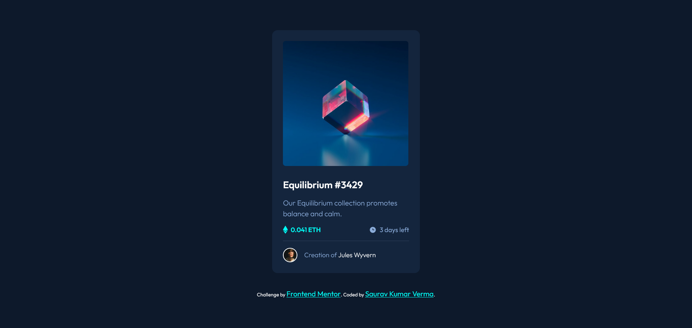
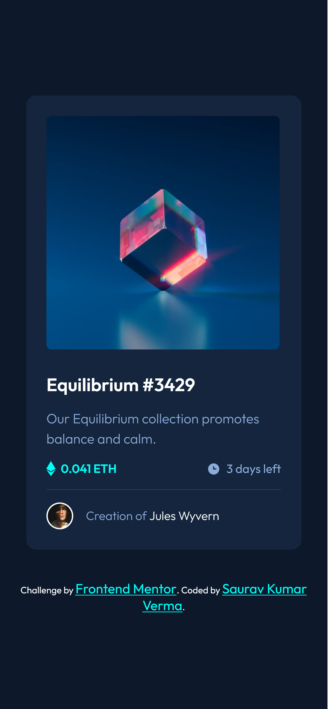
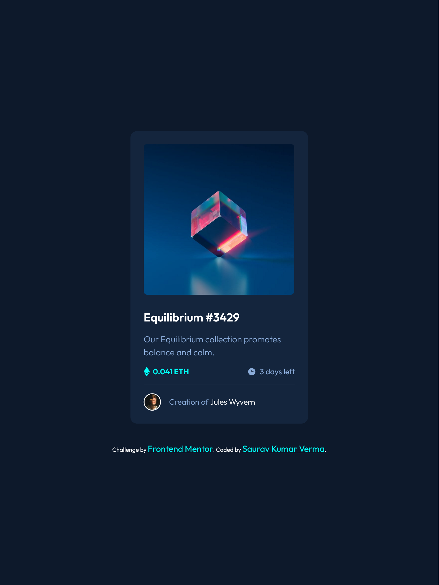
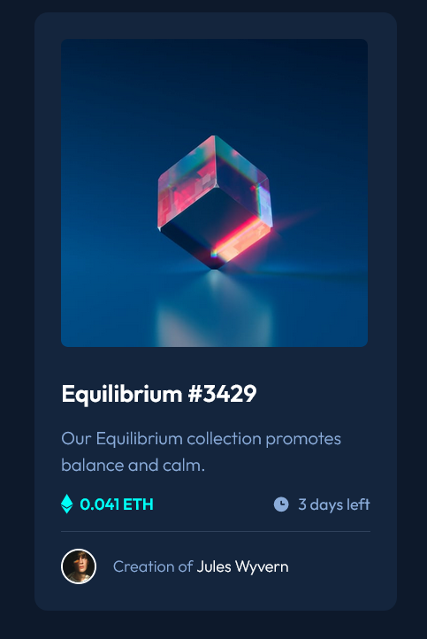
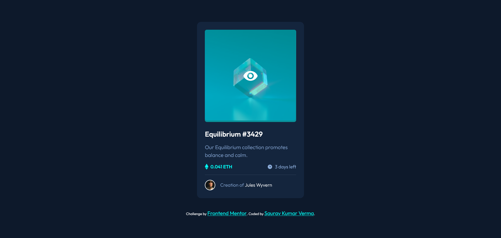

# Frontend Mentor - NFT preview card component solution

This is a solution to the [NFT preview card component challenge on Frontend Mentor](https://www.frontendmentor.io/challenges/nft-preview-card-component-SbdUL_w0U). Frontend Mentor challenges help you improve your coding skills by building realistic projects.

## Table of contents

- [Frontend Mentor - NFT preview card component solution](#frontend-mentor---nft-preview-card-component-solution)
  - [Table of contents](#table-of-contents)
  - [Overview](#overview)
    - [The challenge](#the-challenge)
    - [Screenshot](#screenshot)
    - [Links](#links)
  - [My process](#my-process)
    - [Built with](#built-with)
    - [What I learned](#what-i-learned)
    - [Useful resources](#useful-resources)
  - [Author](#author)

## Overview

### The challenge

Users should be able to:

- View the optimal layout depending on their device's screen size - Completed
- See hover states for interactive elements - Completed

### Screenshot







### Links

- Solution URL: [Add solution URL here](https://github.com/Saurav-98/NFT-preview-card-component)
- Live Site URL: [Add live site URL here](https://nft-card-saurav.netlify.app/)

## My process

1 - Used Figma to understand design desicions ( margin, padding , width and other values of elements) and planned the layout of project.
2 - used HTML to define structure of Project
3 - used CSS custom properties to make the project as similar as possible to the design.
4 - Deployed the site to Netliy.

### Built with

- Semantic HTML5 markup
- CSS custom properties
- Flexbox
- CSS Variables
- SVG Images
- Complex CSS Selectors to manipulate design on Hover
- Mobile-first workflow

### What I learned

Most Challenging and Interesting part was to create the Ovelay on the Image container on hover.
Used Complex CSS Selectors to make it work on hover.

```html
<div class="image-container">
  <div class="image-overlay">
    <!-- view SVG -->
    <svg width="48" height="48" xmlns="http://www.w3.org/2000/svg">
      <g fill="none" fill-rule="evenodd">
        <path d="M0 0h48v48H0z" />
        <path
          d="M24 9C14 9 5.46 15.22 2 24c3.46 8.78 12 15 22 15 10.01 0 18.54-6.22 22-15-3.46-8.78-11.99-15-22-15Zm0 25c-5.52 0-10-4.48-10-10s4.48-10 10-10 10 4.48 10 10-4.48 10-10 10Zm0-16c-3.31 0-6 2.69-6 6s2.69 6 6 6 6-2.69 6-6-2.69-6-6-6Z"
          fill="#FFF"
          fill-rule="nonzero"
        />
      </g>
    </svg>
  </div>
  
</div>
```

```css
.image-overlay {
  width: 100%;
  height: 100%;
  position: absolute;
  display: flex;
  align-items: center;
  justify-content: center;
  background-color: hsla(178, 100%, 50%, 0.5);
  border-radius: 0.34rem;

  left: 0;
  right: 0;
  top: -100%;
  opacity: 0;

  -webkit-transition: all 0.5s ease-in-out 0s;
  -moz-transition: all 0.5s ease-in-out 0s;
  transition: all 0.5s ease-in-out 0s;
}

.image-container:hover .image-overlay {
  top: 0;
  opacity: 1;
}
```

### Useful resources

- [Codepen- ArnaudBalland](https://codepen.io/ArnaudBalland/pen/vGZKLr) - This helped me for understanding about the overlay effect on hover. I really liked this pattern and will use it going forward.

- [Freecodecamp](https://www.freecodecamp.org/news/use-svg-images-in-css-html/) - This is an amazing article which helped me finally understand more about svg and multiple ways to use it on Projects. I'd recommend it to anyone still learning this concept.

## Author

- Github - [Saurav-98](https://github.com/Saurav-98)
- Frontend Mentor - [@Saurav-98](https://www.frontendmentor.io/profile/Saurav-98)
- Twitter - [@SauravKverma22](https://twitter.com/SauravKverma22)
- Linkedin - [Saurav Kumar Verma](https://www.linkedin.com/in/skv22/)
